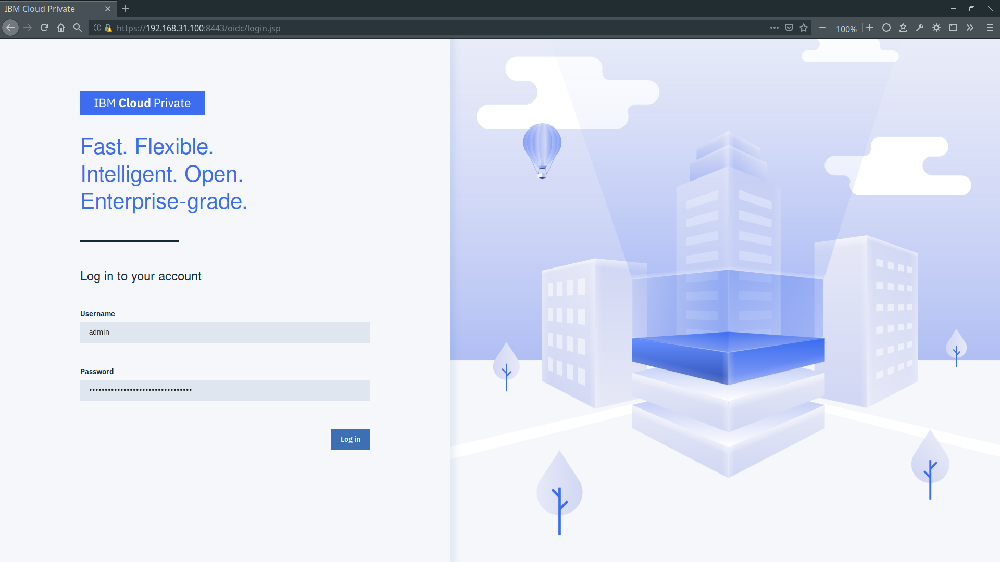
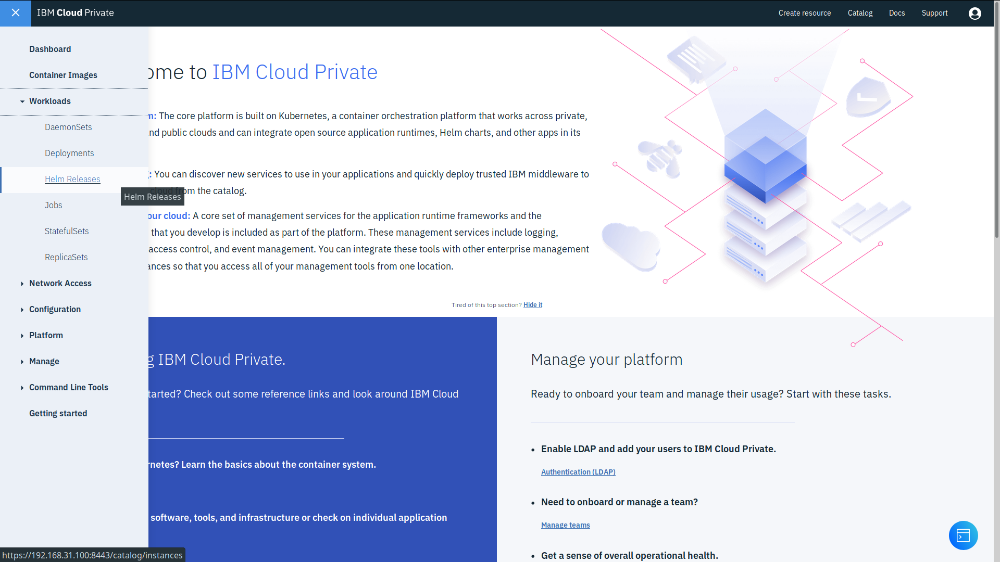

# MongoDB Test for IBM Cloud Private

This is a test client app that attempts to communicate with the MongoDB service/server in the IBM Private Cloud.

Step 0 is of course setting up [IBM Cloud Private](https://www.ibm.com/support/knowledgecenter/en/SSBS6K_1.2.0/kc_welcome_containers.html). I used Vagrant as per the instructions [here](https://github.com/IBM/deploy-ibm-cloud-private/blob/master/docs/deploy-vagrant.md).

After that, you need to configure IBM Cloud Private (via the IBM Cloud Private console) to run a MongoDB service that is accessible by a client. See [Database Setup](#database-setup) below for instructions.

You can further [manage](#managing-your-mongodb-service) it from the IBM Console.

Once all is setup, to start the server, type `npm start`. The password will be automatically retrieved from `kubectl` and IBM Cloud secrets, and will remain hidden to the client. The host and port variables are also automatically setup.

## Database Setup

There seems to be 2 methods to setup the MongoDB service on IBM Cloud Private:
 - [GUI](#gui-method)
 - [Command Line](#command-line)

### GUI Method
First find out where you IBM web console is. If you used the Vagrant setup, it should be in the output with the "happy dance".

For example, my console is hosted at https://192.168.31.100:8443/console. If you did not change the `base_setting` in the Vagrantfile like I did, then yours should be https://192.168.27.100:8443/console by default.

1. Login with your username and password, as set in the `Vagrantfile`

2. Once in, click the **Catalog** button on the top right corner of the page. This will lead you to a Catalog page containing all the included Helm repositories. Search for "*mongodb*" and click on the repository named **ibm-mongodb-dev**

3. You will then be able to configure the MongoDB dev service. Give it a release name (in my case it is *test*), a target namespace (*default* is fine), and check the necessary boxes.

4. We need to make sure that the MongoDB service is accessible outside of the Master node (i.e. an external client must be able to access it). Thus, we need to make sure that the configuration is set as **NodePort** and **NOT** *ClusterIP*.

	To do this, click **Parameters** > *All Parameters* and then scroll down to the part that says **Service configuration** and make sure that **Service Type** is set to **NodePort**.

	Refer to the screenshot below:

	

5. We also need to set a password for our administrator. Below **Service Configuration** is a segment that says **MongoDB Configuration** > **Password for MongoDB Admin User**. You are advised to set a strong one; the password is saved in your secrets file and automatically setup from there anyway.

	Refer to the screenshot below:

6. Click **Install** and you should be done! You can now click on the *View Helm Release* button to view your release. Alternatively see [Managin your MongoDB Service](#managing-your-mongodb-service).

### Command Line
*Sorry, I haven't figured this out yet; I keep getting weird errors.*

## Managing your MongoDB Service

1. To manage your MongoDB service, click the hamburger menu in the top left corner, and go to **Network Access** > **Services**

2. Search for the name of your release (mine was **`dbtest`**)

## Configuring the npm start script
While you could just run `npm start` and see how it goes, you might want to modify the start script according to your setup above.

Depending on what you put as the release name (it is `dbtest` by default), you have to edit the `package.json`'s `start` command accordingly.

For example, if your release name is `mydb` (mine is `dbtest`), replace all occurences of `dbtest-ibm-mongodb-dev` with `mydb-ibm-mongodb-dev`. If you changed the namespace, you will need to change it from `default` to something else as well.

Alternatively, just replace the `start` command with whatever is shown when you view `ibm-mongodb-dev` in the *Services* tab.

## References
Some code based off the awesome tutorial here: https://zellwk.com/blog/crud-express-mongodb/
